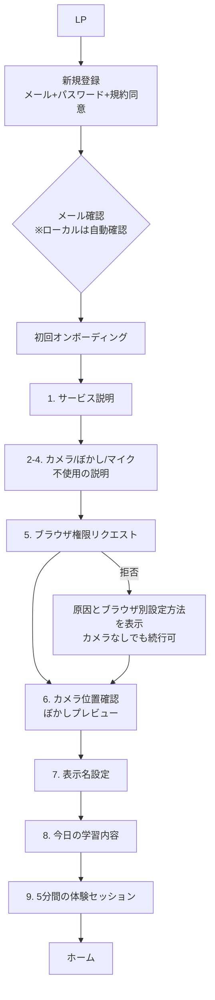
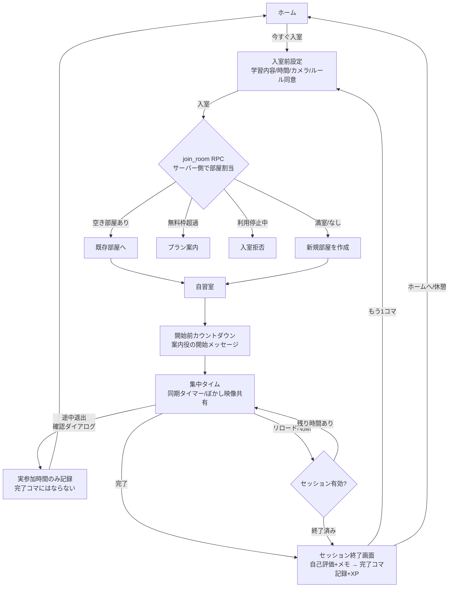
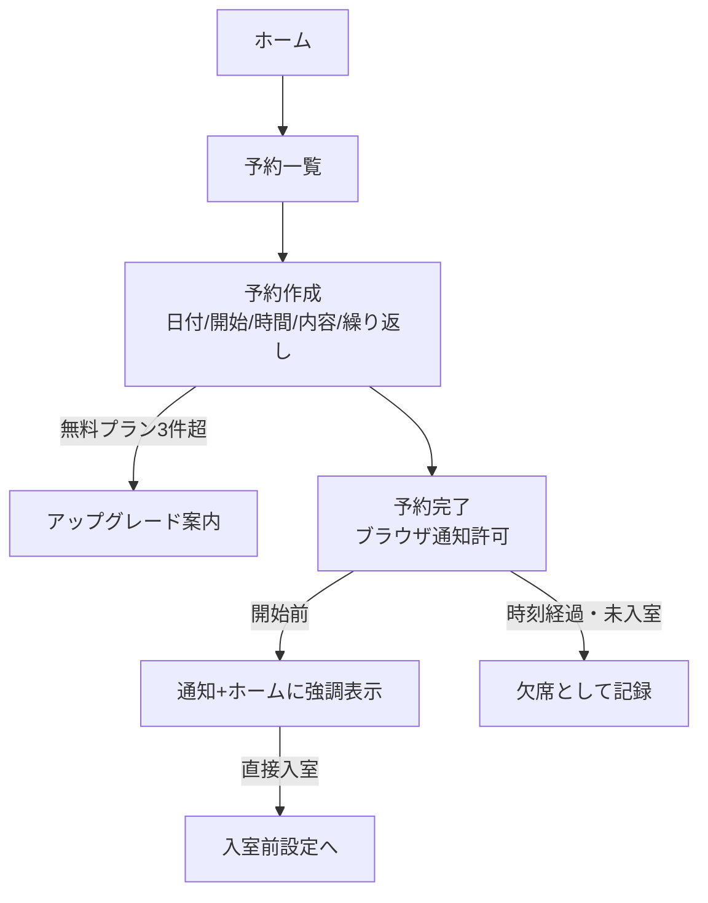

# ユーザーフロー

## 1. 初回利用フロー



## 2. 自習セッションフロー(中心フロー)



## 3. 予約フロー



## 4. 応援者フロー

```
利用者: メールアドレス登録 → 招待メール送信
応援者: メール内リンク → 同意ページ → 同意
以後: 学習開始/完了時に通知、週間レポート (本人がいつでも停止/削除可能)
```

## 5. 通報・管理フロー

```
利用者: 自習室内で参加者を通報(種別+詳細) → reports に記録
管理者: /admin/reports で確認 → 利用停止/解除 → admin_audit_logs に操作記録
利用停止ユーザー: ログイン時・入室時に拒否
```
