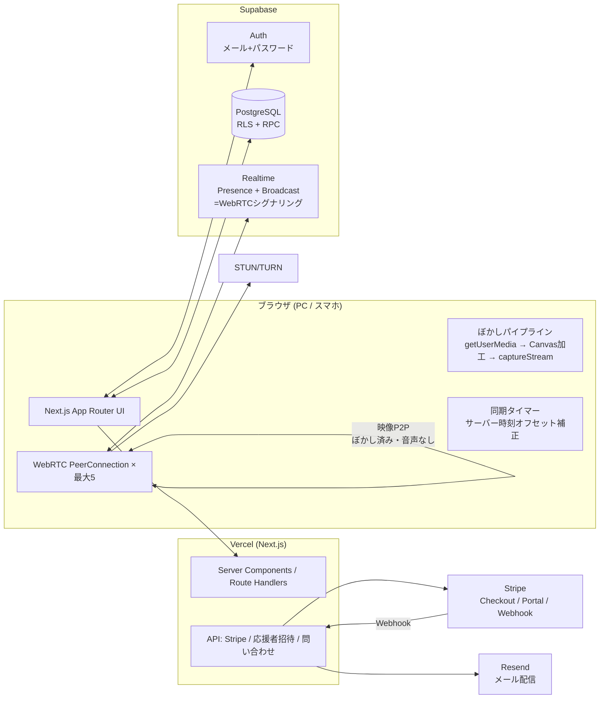

# システム構成・リアルタイム通信方式

## 全体構成図

## リアルタイム通信方式の選定

### 検討した選択肢

| 方式 | 長所 | 短所 | 費用 |
|------|------|------|------|
| **フルメッシュ WebRTC + Supabase Realtime シグナリング (採用/MVP)** | 追加SaaS不要・追加費用ゼロ・映像がサーバーを経由しない(プライバシー上の利点)・依存が少ない | 参加人数がO(n²)で帯域増。6名超は非現実的。TURN費用は別途 | 無料(TURN除く) |
| LiveKit Cloud (正式版の移行先候補) | SFUでスケール・録画等の管理機能・React SDKが充実 | 外部SaaS依存・映像がSFUを経由(暗号化はされる)・キー管理が必要 | 無料枠あり(月間参加分数上限)。超過は従量課金 |
| Daily | 実装が最速・prebuilt UIあり | UIカスタマイズ制約・従量課金 | 無料枠(月間分数上限)あり |
| Agora | 世界規模の低遅延網 | SDKが重い・料金体系が複雑 | 無料枠(月1万分)あり |

### 採用: フルメッシュWebRTC(MVP) → LiveKit(正式版)

**MVPでフルメッシュを採用した理由:**

1. **部屋の最大人数が4〜6名**と小さく、メッシュの限界(概ね6名)に収まる。
   ぼかし加工後の映像は 320×240 / 15fps 程度に落とすため、1ピアあたり
   約150〜300kbps。5ピア同時でも上り約1.5Mbpsに収まる。
2. **映像が自社サーバーを一切経由しない**ため、「鮮明な映像をサーバーへ保存しない」
   「録画しない」という要件を構造的に満たせる(そもそも映像がサーバーに存在しない)。
3. シグナリングは既に採用しているSupabase RealtimeのBroadcast/Presenceで完結し、
   追加インフラ・追加契約が不要。
4. 外部ビデオSaaSのAPIキー管理・課金管理が不要で、個人でも運用できる。

**制約と正式版での移行:**

- NAT越え失敗時のためにTURNサーバー(coturn自前 or Twilio/Metered等)の設定を
  本番では推奨(`.env`で注入可能にしてある)。
- 7名以上の部屋、モバイル回線での安定性向上、サイマルキャストが必要になった時点で
  **LiveKit Cloud** へ移行する。`RoomConnection` インターフェース
  (`src/lib/webrtc/types.ts`)を境界として実装を差し替えられる構成にしている。
  LiveKitでもクライアント側でぼかし加工したトラックをpublishする方式は同一。

## 映像ぼかしの方式選定

| 方式 | 対応状況 | 負荷 | 採用 |
|------|---------|------|------|
| **Canvas 2D `ctx.filter='blur()'` + `captureStream()`** | 全モダンブラウザ(Chrome/Edge/Firefox/Safari 16+) | 低〜中(320×240へ縮小して描画) | ✅ MVP採用 |
| MediaStreamTrackProcessor + WebCodecs | Chrome/Edge のみ(SafariとFirefoxは限定的) | 低(GPU) | 正式版で対応ブラウザのみ最適化パスとして検討 |
| CSSのblur表示のみ | — | — | ❌ 不採用(送信映像が鮮明なまま。要件違反) |

**実装のポイント(`src/lib/media/blur-pipeline.ts`):**

- `getUserMedia({ video: {...}, audio: false })` — **音声トラックはそもそも取得しない**。
- 取得した映像を非表示`<video>`→`<canvas>`へ `filter: blur(強)` で縮小描画し、
  `canvas.captureStream(15)` で得たトラックだけをWebRTCで送信する。
- 生のカメラトラックはPeerConnectionへ**一切追加しない**ため、
  利用者側の操作でぼかしを解除する経路が存在しない。
- ぼかし強度は端末解像度に対して固定比率で適用し、顔・背景とも判別不能な強度
  (縮小×blur 12px相当)とする。設定でぼかしを弱める・切るUIは提供しない。
- タブが非アクティブでも描画が継続するよう `requestAnimationFrame` ではなく
  `setInterval` ベースで描画する。

## タイマー同期方式

- 部屋(`study_rooms`)がサーバー側で `starts_at` / `ends_at` を持つ(作成時にRPCが決定)。
- クライアントは `get_server_time()` RPC を呼び、往復遅延の1/2を補正した
  **サーバー時刻とのオフセット**を保持する。
- 残り時間 = `ends_at - (Date.now() + offset)`。setIntervalのドリフトに依存しない
  絶対時刻ベースのため、バックグラウンドタブ・リロード後も正しい残り時間になる。
- 完了判定はクライアントを信用せず、`finish_session` RPC がサーバー時刻で検証する。
