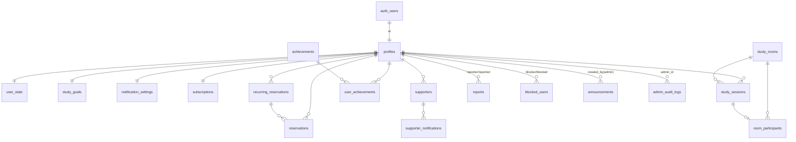

# データベース設計

- すべての日時は `timestamptz`(UTC)で保持し、表示時に `profiles.timezone` で変換する。
- 主キーは原則 `uuid`(`gen_random_uuid()`)。
- 削除方式: 個人データは**退会時に匿名化+auth.users削除(CASCADE)**。業務データ(通報・監査ログ)は保持。お知らせ等は論理削除ではなく物理削除(管理者のみ)。
- `created_at` / `updated_at` を全テーブルに付与し、`updated_at` はトリガで自動更新。
- 実際の定義: `supabase/migrations/` を参照(こちらが正)。

## ER図

## テーブル定義(要約)

| テーブル | 役割 | 主なカラム | 主なインデックス |
|---------|------|-----------|----------------|
| profiles | ユーザー基本情報 | id(PK=auth.users.id), display_name, study_purpose, timezone, role(user/admin), status(active/suspended/deleted), onboarding_completed_at, terms_accepted_at | role, status |
| user_stats | 集計値(改ざん防止のため分離) | user_id(PK), xp, level, current_streak, longest_streak, last_study_date, total_focus_minutes, total_completed_sessions | — |
| study_goals | 目標 | user_id(UQ), daily/weekly/monthly_minutes_goal | user_id |
| study_rooms | 自習室 | id, status(waiting/active/finished), duration_minutes(5/15/25/50), starts_at, ends_at, max_participants, is_trial | (status, duration, ends_at) |
| room_participants | 在室記録 | room_id, user_id, session_id, joined_at, left_at, camera_on / UQ(room_id,user_id) | room_id, user_id |
| study_sessions | 学習セッション記録 | user_id, room_id, topic, planned_minutes, started_at, ended_at, attended_seconds, status(active/completed/left_early/abandoned), rating, memo, xp_awarded, is_trial | (user_id, started_at), 部分UQ: userごとactive1件 |
| reservations | 予約 | user_id, starts_at, duration_minutes, topic, status(scheduled/completed/missed/cancelled), recurring_reservation_id, session_id | (user_id, starts_at) |
| recurring_reservations | 毎週繰り返し予約 | user_id, weekday(0-6), start_time, timezone, duration_minutes, topic, active | user_id |
| achievements | バッジマスタ | id(slug PK), name, description, condition_type, condition_value, icon, sort_order | — |
| user_achievements | 獲得バッジ | user_id, achievement_id, earned_at / UQ(user,achievement) | user_id |
| supporters | 応援者 | user_id, supporter_email, supporter_name, status(pending/accepted/stopped), invite_token(UQ), consented_at, notify_on_start/complete, weekly_report | user_id, invite_token |
| supporter_notifications | 応援者通知ログ | supporter_id, type, channel(email/line※将来), payload, sent_at | supporter_id |
| subscriptions | プラン | user_id(UQ), plan(free/premium), stripe_customer_id, stripe_subscription_id, status, current_period_end | user_id, stripe_customer_id |
| reports | 通報 | reporter_id, reported_user_id, room_id, category(5種), description, status(open/reviewing/resolved/dismissed), resolved_by, resolution_note | status, reported_user_id |
| blocked_users | ブロック | user_id, blocked_user_id / UQ(pair) | user_id |
| announcements | お知らせ | title, body, is_published, published_at, created_by | is_published, published_at |
| notification_settings | 通知設定 | user_id(PK), browser_reservation, email_reservation, email_weekly_summary, sound_enabled | — |
| admin_audit_logs | 管理操作ログ | admin_id, action, target_type, target_id, detail(jsonb) | admin_id, created_at |
| contact_messages | 問い合わせ | name, email, message, status | created_at |

## RLS(権限)設計の原則

| テーブル | 一般ユーザー | 管理者 |
|---------|-------------|--------|
| profiles | 自分の行のSELECT/UPDATE(role,status,xp系は変更不可: 列トリガで拒否)。同室者の表示名はビュー`room_member_public`経由のみ | 全行SELECT/UPDATE(status,role) |
| user_stats | 自分のSELECTのみ(書込は全面拒否=RPCのみ) | 全行SELECT |
| study_goals / notification_settings | 自分の行のみ全操作 | SELECT |
| study_rooms | 参加中/参加した部屋のSELECTのみ。作成・更新はRPC経由 | 全行SELECT/UPDATE |
| room_participants | 自分の行 + 同室の行のSELECT。書込はRPCのみ | 全行SELECT |
| study_sessions | 自分の行のSELECT。INSERT/UPDATEはRPCのみ(改ざん防止) | 全行SELECT |
| reservations / recurring_reservations | 自分の行のみ全操作(件数制限はトリガ) | SELECT |
| achievements | 全員SELECT | 全操作 |
| user_achievements | 自分のSELECTのみ(付与はRPC) | SELECT |
| supporters | 自分の行のみ全操作(招待トークン照合はRPC) | SELECT(メールは管理画面に出さない) |
| supporter_notifications | 自分の応援者分のSELECT | SELECT |
| subscriptions | 自分のSELECTのみ(変更はStripe Webhook=service role) | 全行SELECT |
| reports | 自分が通報した行のSELECT+INSERT(RPC経由でレート制限) | 全行SELECT/UPDATE |
| blocked_users | 自分の行のみ全操作 | SELECT |
| announcements | 公開済みのみSELECT | 全操作 |
| admin_audit_logs | 不可 | SELECT(INSERTはRPC) |
| contact_messages | INSERTのみ(匿名可) | SELECT/UPDATE |

- 管理者判定は `is_admin()`(SECURITY DEFINER)で行い、クライアントの申告を信用しない。
- 「他人の非公開データを取得できないこと」は `supabase/tests/rls.test.sql` で検証する。
